# Leonardo Klein Rezende

### 
Systems Administrator & Developer | 15 Years in Tech | Remote Work Since 2023 👨‍💻

---

## About Me

🎓 **Academic Background**: Graduated in Systems Analysis and Development and IT Management, with specialization in Cloud Computing  
💻 **Current Role**: Systems Administrator with 15+ years of experience in technology, working remotely since 2023  
🔧 **Development Journey**: Python, Java, and PHP developer since 2013, with multiple projects developed and delivered throughout my career  
🎮 **Origin Story**: Started programming through game translations and modding, which sparked my passion for software development  
🏢 **Industry Focus**: Extensive experience in enterprise IT environments, working directly with both infrastructure management and software development projects  

---

## My Skill Set

### Frontend

### Backend

### DevOps

---

## GitHub Statistics

<table>
<tr>
<td></td>
<td></td>
</tr>
</table>

 

 

  
---

## Connect With Me

---

<i>Bridging infrastructure expertise with modern software development</i>

