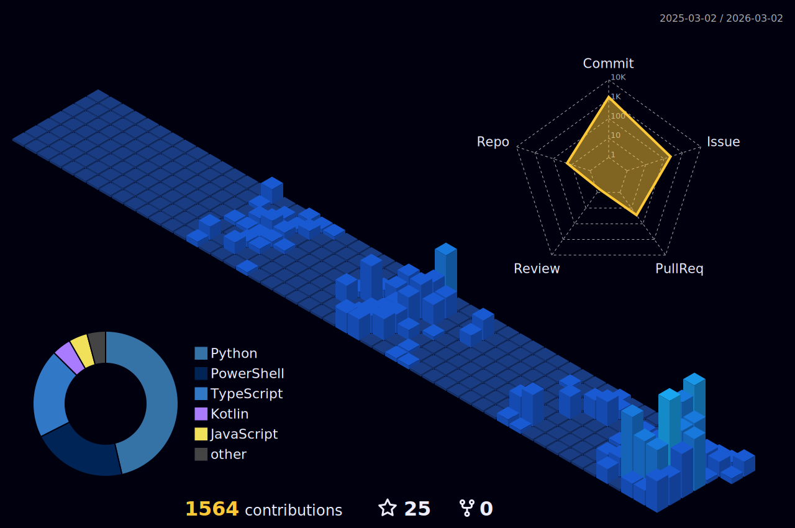

# Leonardo Klein Rezende
Systems Administrator | Developer | 15 Years in Tech | Remote Work Since 2023  
 <!--  -->

<!---->

---

## About Me

🎓 **Academic Background**: Graduated in Systems Analysis and Development and IT Management, with specialization in Cloud Computing  
💻 **Current Role**: Systems Administrator with 15+ years of experience in technology, working remotely since 2023  
🔧 **Development Journey**: Python, Java, and PHP developer since 2013, with multiple projects developed and delivered throughout my career  
🎮 **Origin Story**: Started programming through game translations and modding, which sparked my passion for software development  
🏢 **Industry Focus**: Extensive experience in enterprise IT environments, working directly with both infrastructure management and software development projects  

---

## My Skill Set

<b>Languages & Frameworks</b> 

<b>Databases</b> 

<b>DevOps & Cloud</b> 

---

## GitHub Statistics

 

  
<!--

-->

 

---

"The science of today is the technology of tomorrow" - Edward Teller

